> ## 🌐 English-Language Fork
>
> **This is an English-language translation fork of the open-source project [`xiaozhi-esp32-server`](https://github.com/xinnan-tech/xiaozhi-esp32-server).**
>
> The original Chinese source code, documentation, and user-facing strings have been translated to English
> while preserving functionality. The original project remains the source of truth for upstream changes.
>
> **About this fork:**
> - **Original project:** [xinnan-tech/xiaozhi-esp32-server](https://github.com/xinnan-tech/xiaozhi-esp32-server) — MIT licensed
> - **This fork:** maintained by [Korey Paul Barrett](https://github.com/korey-barrett)
> - **License:** MIT (see [LICENSE](./LICENSE) and [NOTICE](./NOTICE))
>
> **English-first defaults:** This fork uses **EN-US** as the canonical language and ships with
> **non-Chinese** provider defaults — **Google Gemini** (LLM & Vision), **local FunASR/Silero** (ASR/VAD),
> **Microsoft Edge TTS** (English voice), **Open-Meteo** (weather), **Tavily** (web search), and **BBC RSS**
> (news) — so no data is sent to Chinese services out of the box. See
> [FULL-ENGLISH-CONVERSION-CHECKLIST.md](./docs/FULL-ENGLISH-CONVERSION-CHECKLIST.md) for the full plan.
>
> For questions or issues about this translation fork, open an issue here. For issues about the
> original upstream project, please use the [original repository's issue tracker](https://github.com/xinnan-tech/xiaozhi-esp32-server/issues).

---

[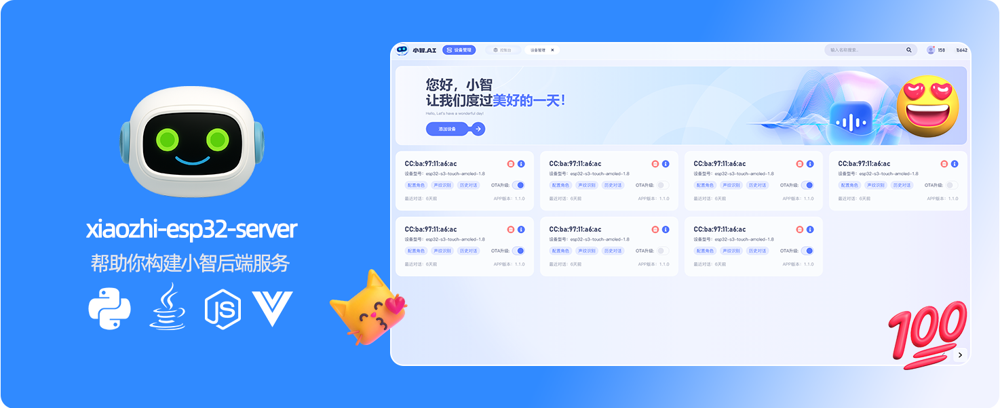](https://github.com/korey-barrett/xiaozhi-esp32-server-en)

<h1 align="center">Xiaozhi Backend Service xiaozhi-esp32-server</h1>

<p align="center">
This project develops an intelligent terminal software and hardware system based on human-machine symbiotic intelligence theory and technology, providing backend services for the open-source intelligent hardware project
<a href="https://github.com/78/xiaozhi-esp32">xiaozhi-esp32</a><br/>
Implemented in Python, Java, and Vue according to the
<a href="https://ccnphfhqs21z.feishu.cn/wiki/M0XiwldO9iJwHikpXD5cEx71nKh">Xiaozhi communication protocol</a><br/>
Supports MQTT+UDP protocol, WebSocket protocol, MCP access points, voiceprint recognition, and knowledge base
</p>

<p align="center">
<a href="./docs/FAQ.md">FAQ</a>
· <a href="https://github.com/korey-barrett/xiaozhi-esp32-server-en/issues">Report Issues</a>
· <a href="./README.md#%E9%83%A8%E7%BD%B2%E6%96%87%E6%A1%A3">Deployment Documentation</a>
· <a href="https://github.com/korey-barrett/xiaozhi-esp32-server-en/releases">Changelog</a>
</p>

<p align="center">
  <a href="./README.md"></a>
  <a href="./docs/readme/README_en.md"></a>
  <a href="./docs/readme/README_vi.md"></a>
  <a href="./docs/readme/README_de.md"></a>
  <a href="./docs/readme/README_pt_BR.md"></a>
  <a href="https://github.com/korey-barrett/xiaozhi-esp32-server-en/releases">
    
  </a>
  <a href="https://github.com/korey-barrett/xiaozhi-esp32-server-en/blob/main/LICENSE">
    
  </a>
  <a href="https://github.com/korey-barrett/xiaozhi-esp32-server-en">
    
  </a>
</p>

<p align="center">
Spearheaded by Professor Siyuan Liu's Team (South China University of Technology)
</br>
Developed by Professor Siyuan Liu's Team (South China University of Technology)
</br>

</p>

---

## Who This Is For 👥

This project requires ESP32 hardware devices. If you have purchased ESP32-related hardware, have successfully connected to the backend service deployed by Xiaoge, and want to independently build your own
`xiaozhi-esp32` backend service, then this project is perfect for you.

Want to see it in action? Click the videos! 🎥

<table>
  <tr>
    <td>
      <a href="https://www.bilibili.com/video/BV1FMFyejExX" target="_blank">
        <picture>
          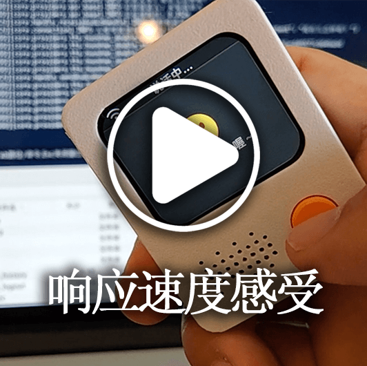</picture>
      </a>
    </td>
    <td>
      <a href="https://www.bilibili.com/video/BV1vchQzaEse" target="_blank">
        <picture>
          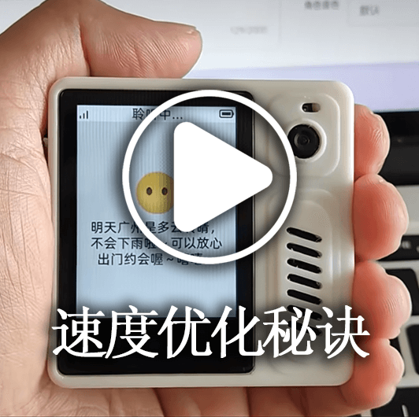</picture>
      </a>
    </td>
    <td>
      <a href="https://www.bilibili.com/video/BV1WEcxzFEAT" target="_blank">
        <picture>
          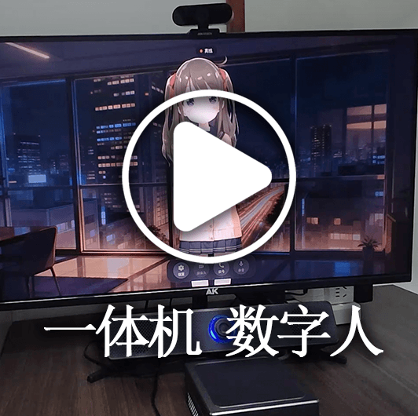</picture>
      </a>
    </td>
    <td>
      <a href="https://www.bilibili.com/video/BV1CKVz6UEuB" target="_blank">
        <picture>
          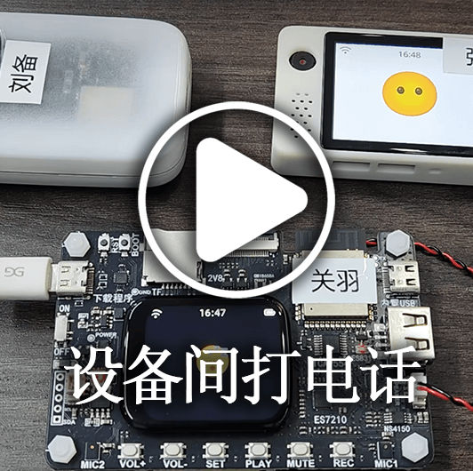</picture>
      </a>
    </td>
    <td>
      <a href="https://www.bilibili.com/video/BV1C1tCzUEZh" target="_blank">
        <picture>
          </picture>
      </a>
    </td>
  </tr>
  <tr>
    <td>
      <a href="https://www.bilibili.com/video/BV1VC96Y5EMH" target="_blank">
        <picture>
          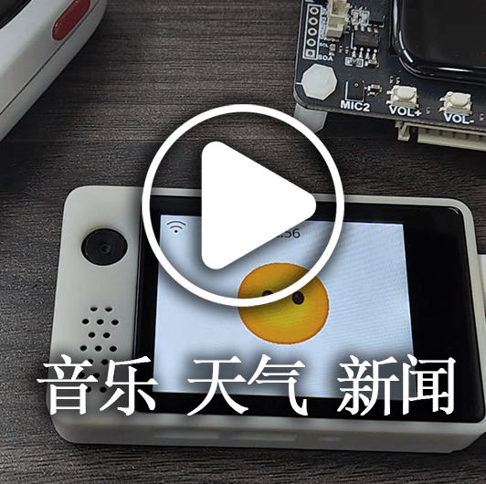</picture>
      </a>
    </td>
    <td>
      <a href="https://www.bilibili.com/video/BV12J7WzBEaH" target="_blank">
        <picture>
          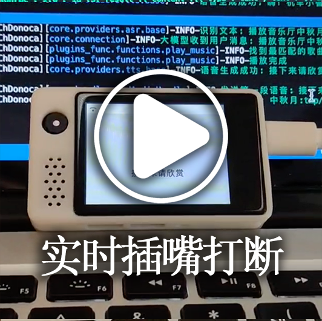</picture>
      </a>
    </td>
    <td>
      <a href="https://www.bilibili.com/video/BV1Co76z7EvK" target="_blank">
        <picture>
          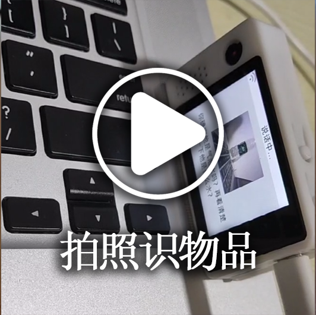</picture>
      </a>
    </td>
    <td>
      <a href="https://www.bilibili.com/video/BV1pNXWYGEx1" target="_blank">
        <picture>
          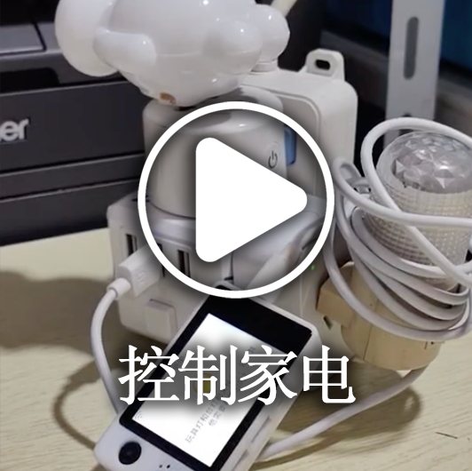</picture>
      </a>
    </td>
    <td>
      <a href="https://www.bilibili.com/video/BV1TJ7WzzEo6" target="_blank">
        <picture>
          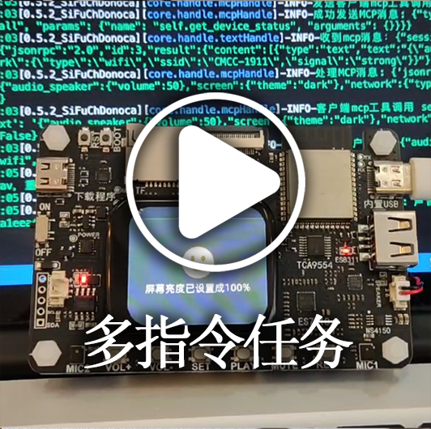</picture>
      </a>
    </td>
  </tr>
  <tr>
    <td>
      <a href="https://www.bilibili.com/video/BV1ZQKUzYExM" target="_blank">
        <picture>
          </picture>
      </a>
    </td>
    <td>
      <a href="https://www.bilibili.com/video/BV1zUW5zJEkq" target="_blank">
        <picture>
          </picture>
      </a>
    </td>
    <td>
      <a href="https://www.bilibili.com/video/BV1Exu3zqEDe" target="_blank">
        <picture>
          </picture>
      </a>
    </td>
    <td>
      <a href="https://www.bilibili.com/video/BV1CDKWemEU6" target="_blank">
        <picture>
          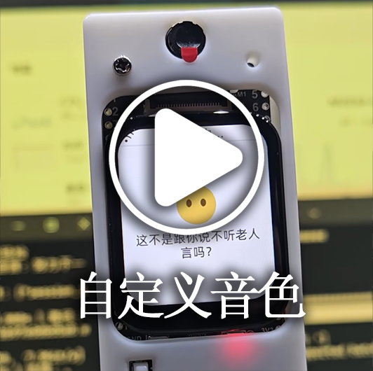</picture>
      </a>
    </td>
    <td>
      <a href="https://www.bilibili.com/video/BV12yA2egEaC" target="_blank">
        <picture>
          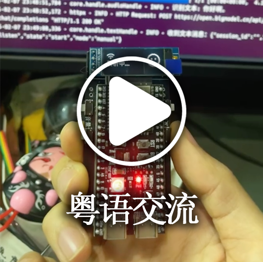</picture>
      </a>
    </td>
  </tr>
</table>

---

## Warning ⚠️

1. This project is open-source software. This software has no commercial partnership with any third-party API service provider it integrates with (including but not limited to speech recognition, large language model, and speech synthesis platforms), and does not provide any form of guarantee for their service quality or fund security. It is recommended that users prioritize service providers holding relevant business licenses and carefully read their service agreements and privacy policies. This software does not host any account keys, does not participate in fund transfers, and does not bear the risk of recharge fund losses.

2. This project's features are not yet complete and it has not passed network security assessment. Do not use it in a production environment. If you deploy this project to learn in a public network environment, be sure to take necessary protective measures.

---

## Deployment Documentation

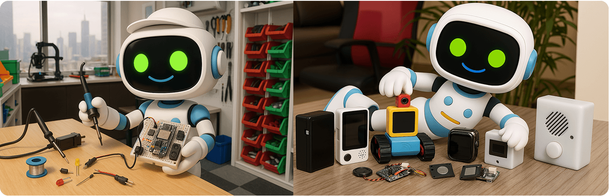

This project offers two deployment methods. Please choose based on your specific needs:

#### 🚀 Deployment Method Selection
| Deployment Method | Features | Applicable Scenarios | Deployment Doc | Configuration Requirements | Video Tutorial | 
|---------|------|---------|---------|---------|---------|
| **Minimal Installation** | Intelligent conversation, single agent management | Low-configuration environment; data stored in config files, no database required | [① Docker version](./docs/Deployment.md#%E6%96%B9%E5%BC%8F%E4%B8%80docker%E5%8F%AA%E8%BF%90%E8%A1%8Cserver) / [② Source code deployment](./docs/Deployment.md#%E6%96%B9%E5%BC%8F%E4%BA%8C%E6%9C%AC%E5%9C%B0%E6%BA%90%E7%A0%81%E5%8F%AA%E8%BF%90%E8%A1%8Cserver)| If using `FunASR`, 2 cores and 4GB; if all API, 2 cores and 2GB | - | 
| **Full Module Installation** | Intelligent conversation, multi-user management, multi-agent management, Console UI operations | Full-featured experience; data stored in database |[① Docker version](./docs/Deployment_all.md#%E6%96%B9%E5%BC%8F%E4%B8%80docker%E8%BF%90%E8%A1%8C%E5%85%A8%E6%A8%A1%E5%9D%97) / [② Source code deployment](./docs/Deployment_all.md#%E6%96%B9%E5%BC%8F%E4%BA%8C%E6%9C%AC%E5%9C%B0%E6%BA%90%E7%A0%81%E8%BF%90%E8%A1%8C%E5%85%A8%E6%A8%A1%E5%9D%97) / [③ Source code deployment auto-update tutorial](./docs/dev-ops-integration.md) | If using `FunASR`, 4 cores and 8GB; if all API, 2 cores and 4GB| [Local source code startup video tutorial](https://www.bilibili.com/video/BV1wBJhz4Ewe) | 

For FAQs and related tutorials, refer to [this link](./docs/FAQ.md)

> 💡 Note: The following is a test platform deployed from the latest code. You can flash and test if needed. Concurrency is 6, and data is cleared daily.

```
Console address: https://2662r3426b.vicp.fun
Console (H5 version): https://2662r3426b.vicp.fun/h5/index.html

Service test tool: https://2662r3426b.vicp.fun/test/
OTA interface address: https://2662r3426b.vicp.fun/xiaozhi/ota/
WebSocket interface address: wss://2662r3426b.vicp.fun/xiaozhi/v1/
```

#### 🚩 Configuration Notes and Recommendations
> [!Note]
> This project provides two configuration options:
> 
> 1. `Free to Start` configuration: suitable for personal and family use; all components use free solutions with no extra charges.
> 
> 2. `Streaming` configuration: suitable for demos, training, more than 2 concurrent connections, etc. It uses streaming processing technology for faster response and a better experience.
> 
> Since version `0.5.2`, the project supports streaming configuration. Compared to earlier versions, response speed improves by about `2.5 seconds`, significantly improving user experience.

| Module Name | Free to Start settings | Streaming configuration |
|:---:|:---:|:---:|
| ASR (Speech Recognition) | FunASR (Local) | 👍XunfeiStreamASR (iFlytek Streaming) |
| LLM (Large Language Model) | Google Gemini (free tier) | 👍qwen-flash (Alibaba Bailian) |
| VLLM (Vision Large Language Model) | Google Gemini (free tier) | 👍qwen3.5-flash (Alibaba Bailian) |
| TTS (Speech Synthesis) | EdgeTTS (Microsoft, English voice) | 👍HuoshanDoubleStreamTTS (Volcano Streaming) |
| Intent (Intent Recognition) | function_call (function calling) | function_call (function calling) |
| Memory | nomem (no memory) | mem_local_short (local short-term memory) |

If you care about the latency of each component, please refer to the [Xiaozhi component performance test report](https://github.com/xinnan-tech/xiaozhi-performance-research). You can actually test it in your own environment using the testing methods described in the report.

#### 🔧 Test Tools
This project provides the following test tools to help you verify the system and choose the right models:

| Tool Name | Location | How to Use | Description |
|:---:|:---|:---:|:---:|
| Audio interaction test tool | main》digital-human》index.html | Run `python start.py` in `main/digital-human`, then visit `http://127.0.0.1:8006/index.html` | Tests audio playback and reception to verify that the Python-side audio processing works correctly |
| Model response test tool | main》xiaozhi-server》performance_tester.py | Run `python performance_tester.py` | Tests the response speed of the three core modules: ASR (speech recognition), LLM (large language model), VLLM (vision model), and TTS (speech synthesis) |

> 💡 Note: When testing model speed, only models with configured keys will be tested.

---

## Headless Device Onboarding 🔌

Devices without a screen (headless ESP32 boards) can be onboarded over serial. The **MAC address** and the
**6-digit setup code** (needed to install the device in the admin console) are read from the serial port.

**Prerequisites:** `esptool` and `pyserial` installed (`pip install esptool pyserial`).

**Step 1 — Read the MAC address (also resets the board):**
```powershell
esptool --port COM<port> read_mac
```

**Step 2 — Capture the boot log to get the 6-digit setup code:**
```powershell
python capture_serial.py COM<port>
```
`capture_serial.py` (repo root) opens the port, captures ~15s of boot output at 115200 baud, and prints it.
The boot log contains the 6-digit setup code used to install the device in the admin console.

> 💡 The `read_mac` command resets the board via the RTS pin, so run it first, then immediately capture
> the serial output to catch the setup code printed during boot.

> 💡 **New vs. known device:** when you enter the setup code in the admin console, the same prompt checks
> whether the device is **new** or **already known** and acts accordingly. A brand-new device is registered;
> an already-added device (matching MAC) logs straight into the server — no duplicate is created.

> 🔒 **Security:** only the operator can add new devices (the 6-digit setup code is obtained over serial).
> Known devices auto-login on matching MAC, so no one can silently register a device on the server.

---
## Feature List ✨
### Implemented ✅
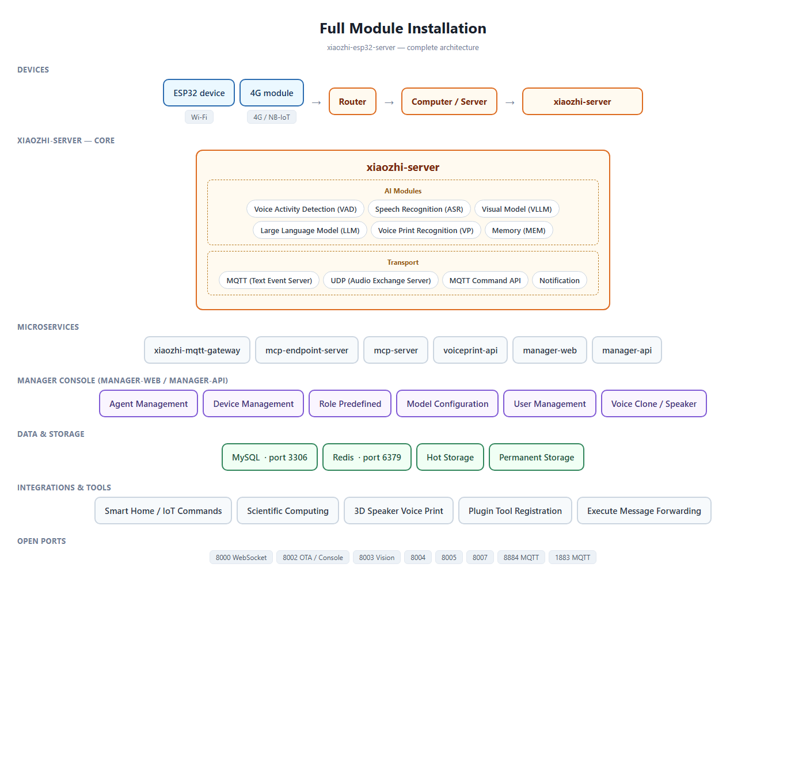
| Feature Module | Description |
|:---:|:---|
| Core Architecture | Based on [MQTT+UDP gateway](https://github.com/xinnan-tech/xiaozhi-esp32-server/blob/main/docs/mqtt-gateway-integration.md), WebSocket, and HTTP servers, providing a complete console management and authentication system |
| Voice Interaction | Supports streaming ASR (speech recognition), streaming TTS (speech synthesis), VAD (voice activity detection), multi-language recognition, and speech processing |
| Voiceprint Recognition | Supports multi-user voiceprint registration, management, and recognition, processing in parallel with ASR to identify the speaker in real time and pass the identity to the LLM for personalized responses |
| Intelligent Conversation | Supports multiple LLMs (large language models) for intelligent conversation |
| Visual Perception | Supports multiple VLLMs (vision large language models) for multimodal interaction |
| Intent Recognition | Supports external large-model intent recognition and autonomous function calling, providing a plugin-based intent processing mechanism |
| Memory System | Supports local short-term memory, mem0ai interface memory, and PowerMem smart memory, with memory summarization |
| Knowledge Base | Supports the RAGFlow knowledge base, letting the large model decide whether to query the knowledge base before answering |
| Tool Calling | Supports the client IoT protocol, client MCP protocol, server MCP protocol, MCP access point protocol, and custom tool functions |
| Command Dispatch | Based on the MQTT protocol, supports dispatching MCP commands from the Console to ESP32 devices |
| Admin Console | Provides a web management interface supporting user management, system configuration, and device management; the interface defaults to **English** (also supports Simplified Chinese, Traditional Chinese, and other languages) |
| SSO Login | Sign in with **Google / Apple / Microsoft / GitHub** (OAuth2/OIDC) plus a **passcode** second factor |
| Test Tools | Provides performance test tools, vision model test tools, and audio interaction test tools |
| Deployment Support | Supports Docker and local deployment, with complete configuration file management |
| Plugin System | Supports functional plugin extensions, custom plugin development, and plugin hot-reloading |

### In Development 🚧

- **SSO login** via Google / Apple / Microsoft / GitHub accounts, with a **passcode requirement**.
  - ✅ Google, Apple, Microsoft, GitHub implemented (JustAuth 1.16.7) + passcode.

To learn about the specific development plan progress, [click here](https://github.com/users/xinnan-tech/projects/3). For FAQs and related tutorials, refer to [this link](./docs/FAQ.md)

If you are a software developer, here is an [Open Letter to Developers](docs/contributor_open_letter.md). Welcome aboard!

---

## Product Ecosystem 👬
Xiaozhi is an ecosystem. When you use this product, you can also check out other [outstanding projects](https://github.com/78/xiaozhi-esp32/blob/main/README_zh.md#%E7%9B%B8%E5%85%B3%E5%BC%80%E6%BA%90%E9%A1%B9%E7%9B%AE) in this ecosystem.

---

## Supported Platforms / Components 📋
### LLM Language Models

| Usage | Supported Platforms | Free Platforms |
|:---:|:---:|:---:|
| openai API calling | Alibaba Bailian, Volcano Engine, DeepSeek, Zhipu, Gemini, iFlytek | Zhipu, Gemini |
| ollama API calling | Ollama | - |
| dify API calling | Dify | - |
| fastgpt API calling | Fastgpt | - |
| coze API calling | Coze | - |
| xinference API calling | Xinference | - |
| homeassistant API calling | HomeAssistant | - |

In fact, any LLM that supports the openai API can be integrated.

---

### VLLM Vision Models

| Usage | Supported Platforms | Free Platforms |
|:---:|:---:|:---:|
| openai API calling | Alibaba Bailian, Zhipu ChatGLMVLLM | Zhipu ChatGLMVLLM |

In fact, any VLLM that supports the openai API can be integrated.

---

### TTS Speech Synthesis

| Usage | Supported Platforms | Free Platforms |
|:---:|:---:|:---:|
| API calling | EdgeTTS, iFlytek, Volcano Engine, Tencent Cloud, Alibaba Cloud and Bailian, CosyVoiceSiliconflow, TTS302AI, CozeCnTTS, GizwitsTTS, ACGNTTS, OpenAITTS, Lingxi Streaming TTS, MinimaxTTS | Lingxi Streaming TTS, EdgeTTS, CosyVoiceSiliconflow (partial) |
| Local service | FishSpeech, GPT_SOVITS_V2, GPT_SOVITS_V3, Index-TTS, PaddleSpeech | Index-TTS, PaddleSpeech, FishSpeech, GPT_SOVITS_V2, GPT_SOVITS_V3 |

---

### VAD Voice Activity Detection

| Type  |   Platform Name    | Usage | Pricing Model | Notes |
|:---:|:---------:|:----:|:----:|:--:|
| VAD | SileroVAD | Local |  Free  |    |

---

### ASR Speech Recognition

| Usage | Supported Platforms | Free Platforms |
|:---:|:---:|:---:|
| Local | FunASR, SherpaASR | FunASR, SherpaASR |
| API calling | FunASRServer, Volcano Engine, iFlytek, Tencent Cloud, Alibaba Cloud, Baidu Cloud, OpenAI ASR | FunASRServer |

---

### Voiceprint Recognition

| Usage | Supported Platforms | Free Platforms |
|:---:|:---:|:---:|
| Local | 3D-Speaker | 3D-Speaker |

---

### Memory Storage

|   Type   |      Platform Name       | Usage |   Pricing Model    | Notes |
|:------:|:---------------:|:----:|:---------:|:--:|
| Memory |     mem0ai      | API calling | 1000 calls/month quota |    |
| Memory |     [powermem](./docs/powermem-integration.md)    | Local summarization | Depends on LLM and DB |  OceanBase is open source, supports smart retrieval  |
| Memory | mem_local_short | Local summarization |    Free     |    |
| Memory |     nomem       | No-memory mode |    Free     |    |

---

### Intent Recognition

|   Type   |      Platform Name      | Usage |  Pricing Model   |          Notes           |
|:------:|:-------------:|:----:|:-------:|:---------------------:|
| Intent |  intent_llm   | API calling | Billed by LLM usage |    Identifies intent via a large model; highly versatile     |
| Intent | function_call | API calling | Billed by LLM usage | Completes intent via large-model function calling; fast and effective |
| Intent |    nointent   | No-intent mode |    Free     |    No intent recognition; returns the conversation result directly     |

---

### RAG Retrieval-Augmented Generation

|   Type   |      Platform Name      | Usage |  Pricing Model   |          Notes           |
|:------:|:-------------:|:----:|:-------:|:---------------------:|
| Rag |  ragflow   | API calling | Billed by tokens consumed for chunking and tokenization |    Leverages RagFlow's retrieval-augmented generation to provide more accurate conversation replies     |

---

## Acknowledgments 🙏

| Logo | Project / Company | Description |
|:---:|:---:|:---|
|  | [Bailing Voice Conversation Robot](https://github.com/wwbin2017/bailing) | This project is inspired by and built upon the [Bailing Voice Conversation Robot](https://github.com/wwbin2017/bailing) |
|  | [TenClass](https://www.tenclass.com/) | Thanks to [TenClass](https://www.tenclass.com/) for defining the standard communication protocol, multi-device compatibility solution, and high-concurrency scenario practice examples for the Xiaozhi ecosystem, and for providing full-chain technical documentation support for this project |
|  | [Xuanfeng Technology](https://github.com/Eric0308) | Thanks to [Xuanfeng Technology](https://github.com/Eric0308) for contributing the implementation code for the function-calling framework, MCP communication protocol, and plugin-based calling mechanism, which significantly improved the interaction efficiency and functional extensibility of front-end IoT devices through a standardized command dispatch system and dynamic extension capabilities |
|  | [huangjunsen](https://github.com/huangjunsen0406) | Thanks to [huangjunsen](https://github.com/huangjunsen0406) for contributing the `Console Mobile` module, enabling efficient control and real-time interaction on cross-platform mobile devices, greatly improving operational convenience and management efficiency in mobile scenarios |
|  | [Huiyuan Design](http://ui.kwd988.net/) | Thanks to [Huiyuan Design](http://ui.kwd988.net/) for providing professional visual solutions for this project, empowering this project's product user experience with design experience gained from serving over a thousand enterprises |
|  | [Xi'an Qinren Information Technology](https://www.029app.com/) | Thanks to [Xi'an Qinren Information Technology](https://www.029app.com/) for deepening this project's visual system, ensuring the consistency and scalability of the overall design style across multi-scenario applications |
|  | [Code Contributors](https://github.com/xinnan-tech/xiaozhi-esp32-server/graphs/contributors) | Thanks to [all code contributors](https://github.com/xinnan-tech/xiaozhi-esp32-server/graphs/contributors) — your contributions make the project more robust and powerful |


<a href="https://www.star-history.com/?repos=xinnan-tech%2Fxiaozhi-esp32-server&type=date&legend=top-left">
  <picture>
    <source media="(prefers-color-scheme: dark)" srcset="https://api.star-history.com/chart?repos=xinnan-tech/xiaozhi-esp32-server&type=date&theme=dark&legend=top-left&sealed_token=cQovHKgZjqEnQ-svfYfN392irNvGuq-6pyv4cA8nd2jQEhQLz1ETV4YHTVk2UZyLMFbCQuZA7jduRh3YbeK5WPYaRLrfmIimGQa3lram652jJL9oQk-UuSZA5H6L4dPIhZc8KCc-Ur_UAUNbly7TePpnTR2otGknBLCOjOliD4fk1st6z7tPEDVjSRx5" />
    <source media="(prefers-color-scheme: light)" srcset="https://api.star-history.com/chart?repos=xinnan-tech/xiaozhi-esp32-server&type=date&legend=top-left&sealed_token=cQovHKgZjqEnQ-svfYfN392irNvGuq-6pyv4cA8nd2jQEhQLz1ETV4YHTVk2UZyLMFbCQuZA7jduRh3YbeK5WPYaRLrfmIimGQa3lram652jJL9oQk-UuSZA5H6L4dPIhZc8KCc-Ur_UAUNbly7TePpnTR2otGknBLCOjOliD4fk1st6z7tPEDVjSRx5" />
    
  </picture>
</a>
