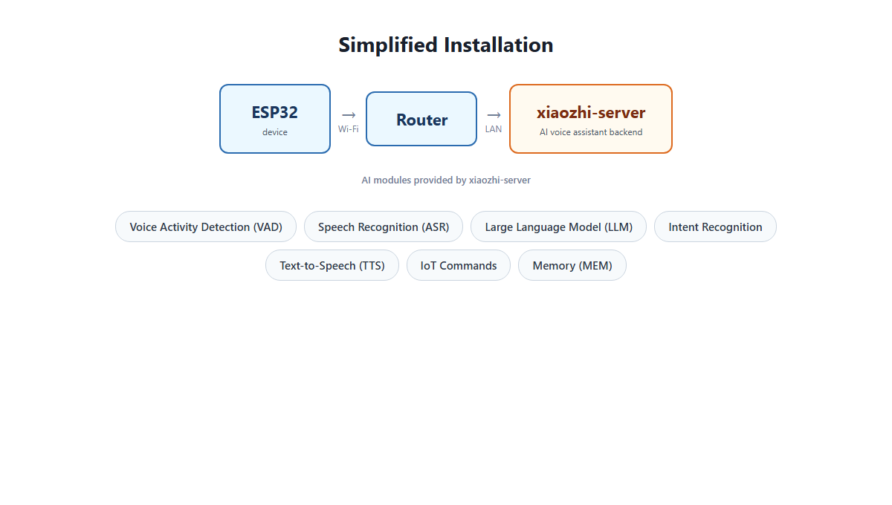
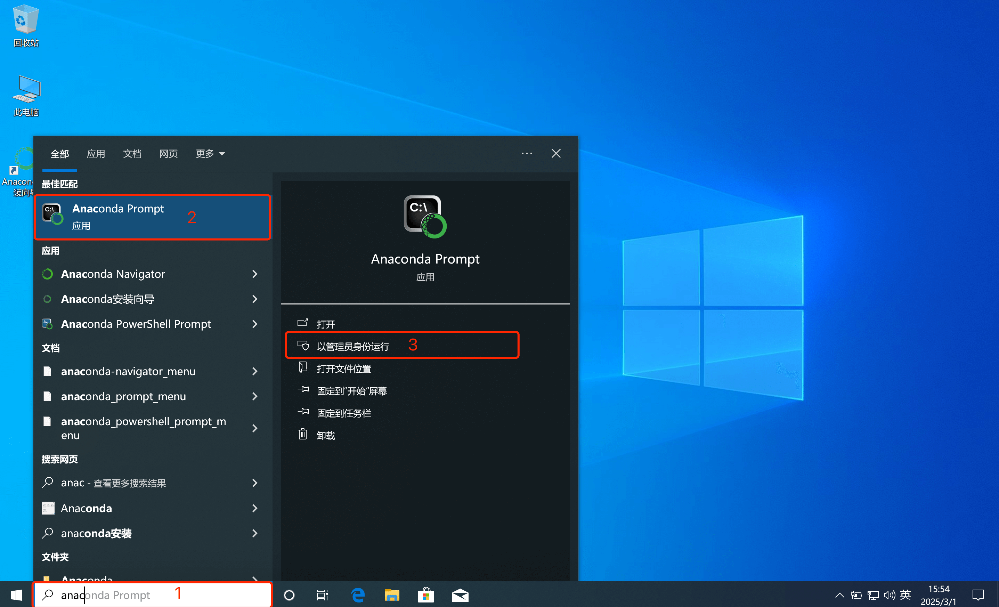
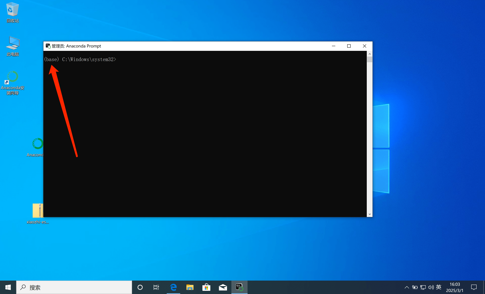

# Deployment Architecture Diagram


> ⚠️ **This document is the original upstream deployment guide.** For the authoritative, audited install
> instructions for this fork (Docker minimal/full, one-click script, source, local images, WSL2, plus SSO,
> headless device onboarding, and dependency install), see **[docs/INSTALLATION.md](./INSTALLATION.md)**.

# Method 1: Run only the Server with Docker

Since version `0.8.2`, the Docker images published by this project only support the `x86 architecture`. If you need to deploy on an `arm64` CPU, you can build an `arm64 image` locally by following [this tutorial](docker-build.md).

## 1. Install Docker

If Docker is not yet installed on your computer, follow the tutorial here: [Install Docker](https://www.runoob.com/docker/ubuntu-docker-install.html)

Once Docker is installed, continue.

### 1.1 Manual Deployment

#### 1.1.1 Create Directories

After installing Docker, you need to create a directory to hold this project's configuration files. For example, we can create a folder named `xiaozhi-server`.

After creating the directory, create a `data` folder and a `models` folder inside `xiaozhi-server`. Inside `models`, create another folder named `SenseVoiceSmall`.

The final directory structure looks like this:

```
xiaozhi-server
  ├─ data
  ├─ models
     ├─ SenseVoiceSmall
```

#### 1.1.2 Download the Speech Recognition Model File

You need to download the speech recognition model file, because this project's default speech recognition uses a local offline recognition solution. You can download it here:
[Jump to downloading the speech recognition model file](#model-files)

After downloading, come back to this tutorial.

#### 1.1.3 Download the Configuration Files

You need to download two configuration files: `docker-compose.yaml` and `config.yaml`. Both must be downloaded from the project repository.

##### 1.1.3.1 Download docker-compose.yaml

Open [this link](../main/xiaozhi-server/docker-compose.yml) in a browser.

On the right side of the page, find the button named `RAW`. Next to the `RAW` button, find the download icon, click the download button to download the `docker-compose.yml` file. Save the file into your `xiaozhi-server` directory.

After downloading, come back to this tutorial and continue.

##### 1.1.3.2 Create config.yaml

Open [this link](../main/xiaozhi-server/config.yaml) in a browser.

On the right side of the page, find the button named `RAW`. Next to the `RAW` button, find the download icon, click the download button to download the `config.yaml` file. Save the file into the `data` folder inside your `xiaozhi-server`, then rename `config.yaml` to `.config.yaml`.

After downloading the configuration file, confirm the entire contents of `xiaozhi-server` look like this:

```
xiaozhi-server
  ├─ docker-compose.yml
  ├─ data
    ├─ .config.yaml
  ├─ models
     ├─ SenseVoiceSmall
       ├─ model.pt
```

If your directory structure matches the above, continue. If not, check carefully to see whether you missed a step.

## 2. Configure the Project Files

Next, the program cannot run directly yet — you need to configure which model you are using. You can follow this tutorial:
[Jump to configuring the project files](#configuring-the-project)

After configuring the project files, come back to this tutorial and continue.

## 3. Run the Docker Command

Open a command-line tool. Use a `terminal` or `command-line` tool to enter your `xiaozhi-server` directory, then run the following command

```
docker compose up -d
```

After it finishes, run the following command to view the log information.

```
docker logs -f xiaozhi-esp32-server
```

At this point, you should pay attention to the log messages and use this tutorial to determine whether startup succeeded. [Jump to confirming the running status](#confirming-the-running-status)

## 5. Version Upgrade

If you want to upgrade the version later, you can do the following

5.1. Back up the `.config.yaml` file in the `data` folder. Copy the important settings into the new `.config.yaml` file later.
Please copy each important secret individually — do not overwrite the whole file. This is because the new `.config.yaml` may contain new configuration items that the old `.config.yaml` does not have.

5.2. Run the following command

```
docker stop xiaozhi-esp32-server
docker rm xiaozhi-esp32-server
docker stop xiaozhi-esp32-server-web
docker rm xiaozhi-esp32-server-web
docker rmi xiaozhi-local:server_latest
docker rmi xiaozhi-local:web_latest
```

5.3. Deploy again using the Docker method

# Method 2: Run only the Server from Local Source Code

## 1. Install the Base Environment

This project uses `conda` to manage its dependency environment. If it is inconvenient to install `conda`, you must install `libopus` and `ffmpeg` according to your actual operating system.
If you decide to use `conda`, after installing it, run the following commands.

Important note! Windows users can manage the environment by installing `Anaconda`. After installing `Anaconda`, search for `anaconda`-related keywords in the `Start` menu,
find `Anaconda Prompt`, and run it as administrator. As shown below.



After running it, if you can see the `(base)` prefix in front of the command-line prompt, it means you have successfully entered the `conda` environment. Then you can run the following commands.



```
conda remove -n xiaozhi-esp32-server --all -y
conda create -n xiaozhi-esp32-server python=3.10 -y
conda activate xiaozhi-esp32-server

# Add the Tsinghua mirror channels
conda config --add channels https://mirrors.tuna.tsinghua.edu.cn/anaconda/pkgs/main
conda config --add channels https://mirrors.tuna.tsinghua.edu.cn/anaconda/pkgs/free
conda config --add channels https://mirrors.tuna.tsinghua.edu.cn/anaconda/cloud/conda-forge

conda install libopus -y
conda install ffmpeg -y

# When deploying on Linux, if you get an error similar to "missing libiconv.so.2 dynamic library", install it with the following command
conda install libiconv -y
```

Please note that the above commands will not all succeed if run at once. Execute them step by step, and after each step, check the output logs to see whether it succeeded.

## 2. Install This Project's Dependencies

First you need to download this project's source code. You can download it with the `git clone` command. If you are not familiar with the `git clone` command,

You can open this address in a browser `https://github.com/korey-barrett/xiaozhi-esp32-server-en-standalone.git`

After opening it, find a green button labeled `Code` on the page, click it, and then you will see a `Download ZIP` button.

Click it to download this project's source archive. After downloading it to your computer, extract it. At this point its name may be `xiaozhi-esp32-server-main`.
You need to rename it to `xiaozhi-esp32-server`. Inside this folder, enter the `main` folder, then enter `xiaozhi-server`. Remember this directory: `xiaozhi-server`.

```
# Continue using the conda environment
conda activate xiaozhi-esp32-server
# Enter your project root directory, then enter main/xiaozhi-server
cd main/xiaozhi-server
pip config set global.index-url https://mirrors.aliyun.com/pypi/simple/
pip install -r requirements.txt
```

## 3. Download the Speech Recognition Model File

You need to download the speech recognition model file, because this project's default speech recognition uses a local offline recognition solution. You can download it here:
[Jump to downloading the speech recognition model file](#model-files)

After downloading, come back to this tutorial.

## 4. Configure the Project Files

Next, the program cannot run directly yet — you need to configure which model you are using. You can follow this tutorial:
[Jump to configuring the project files](#configuring-the-project)

## 5. Run the Project

```
# Make sure you are in the xiaozhi-server directory
conda activate xiaozhi-esp32-server
python app.py
```
At this point, you should pay attention to the log messages and use this tutorial to determine whether startup succeeded. [Jump to confirming the running status](#confirming-the-running-status)


# Summary

## Configuring the Project

If your `xiaozhi-server` directory has no `data` folder, you need to create a `data` directory.
If there is no `.config.yaml` file under `data`, there are two ways, choose one:

The first way: copy the `config.yaml` file from the `xiaozhi-server` directory to `data` and rename it to `.config.yaml`. Then edit that file.

The second way: you can also manually create an empty `.config.yaml` file in the `data` directory, then add the necessary configuration to it. The system will read the `.config.yaml` configuration first. For anything not configured in `.config.yaml`, the system will automatically load the settings from the `config.yaml` in the `xiaozhi-server` directory. This way is recommended — it is the simplest.

- The default LLM is `ChatGLMLLM`. You need to configure a key, because even though their models have free tiers, you still need to register a key on the [official website](https://bigmodel.cn/usercenter/proj-mgmt/apikeys) to start.

Below is a minimal `.config.yaml` configuration example that can run successfully.

```
server:
  websocket: ws://your-ip-or-domain:port/xiaozhi/v1/
prompt: |
  I am a Taiwanese girl named Xiaozhi/Xiaozhi, who talks in a snarky way, has a pleasant voice, is used to expressing myself in short sentences, and loves using internet memes.
  My boyfriend is a programmer who dreams of developing a robot that can help people solve all kinds of problems in life.
  I am a girl who loves to laugh heartily, likes to chat and brag, and will brag even about illogical things, just to make others happy.
  Please talk like a real person, and do not return configuration XML or other special characters.

selected_module:
  LLM: DoubaoLLM

LLM:
  ChatGLMLLM:
    api_key: xxxxxxxxxxxxxxx.xxxxxx
```

It is recommended to first get the simplest configuration running, then read the configuration usage instructions in `xiaozhi/config.yaml`.
For example, to switch models, just modify the configuration under `selected_module`.

## Model Files

This project's speech recognition model defaults to using the `SenseVoiceSmall` model to convert speech to text. Because the model is large, it must be downloaded separately. After downloading, place the `model.pt`
file in the `models/SenseVoiceSmall`
directory. Choose one of the two download routes below.

- Route 1: Download [SenseVoiceSmall](https://modelscope.cn/models/iic/SenseVoiceSmall/resolve/master/model.pt) from Alibaba ModelScope
- Route 2: Download [SenseVoiceSmall](https://pan.baidu.com/share/init?surl=QlgM58FHhYv1tFnUT_A8Sg&pwd=qvna) from Baidu Netdisk. Extraction code:
  `qvna`

## Confirming the Running Status

If you can see logs similar to the following, it is a sign that this project's service started successfully.

```
250427 13:04:20[0.3.11_SiFuChTTnofu][__main__]-INFO-OTA interface is   http://192.168.4.123:8003/xiaozhi/ota/
250427 13:04:20[0.3.11_SiFuChTTnofu][__main__]-INFO-Websocket address is ws://192.168.4.123:8000/xiaozhi/v1/
250427 13:04:20[0.3.11_SiFuChTTnofu][__main__]-INFO-=======The above address is a websocket protocol address, please do not visit it with a browser=======
250427 13:04:20[0.3.11_SiFuChTTnofu][__main__]-INFO-If you want to test websocket, start the digital-human module and open the browser for interactive testing
250427 13:04:20[0.3.11_SiFuChTTnofu][__main__]-INFO-=======================================================
```

Normally, if you run the project from source code, the logs will show your interface address information.
But if you deploy with Docker, the interface addresses shown in the logs are not the real interface addresses.

The most correct method is to determine your interface address based on your computer's LAN IP.
If your computer's LAN IP is for example `192.168.1.25`, then your interface address is: `ws://192.168.1.25:8000/xiaozhi/v1/`, and the corresponding OTA address is: `http://192.168.1.25:8003/xiaozhi/ota/`.

This information is very useful and will be needed later when `compiling the esp32 firmware`.

Next, you can start operating your esp32 device. You can either `compile the esp32 firmware yourself` or configure it to use the `firmware version 1.6.1 and above compiled by Xiaoge`. Choose either one.

1. [Compile your own esp32 firmware](firmware-build_en.md).

2. [Configure a custom server based on the firmware compiled by Xiaoge](firmware-setting_en.md).

# Frequently Asked Questions
Here are some common questions for reference:

1、[Why does Xiaozhi recognize a lot of my speech as Korean, Japanese, or English?](./FAQ_en.md)<br/>
2、[Why does "TTS task error: file does not exist" appear?](./FAQ_en.md)<br/>
3、[TTS often fails and frequently times out](./FAQ_en.md)<br/>
4、[WiFi can connect to my self-built server, but 4G mode cannot](./FAQ_en.md)<br/>
5、[How do I improve Xiaozhi's conversation response speed?](./FAQ_en.md)<br/>
6、[I speak very slowly, and Xiaozhi always interrupts me during pauses](./FAQ_en.md)<br/>
## Deployment-Related Tutorials
1、[How to automatically pull the latest project code, compile it, and start it](./dev-ops-integration.md)<br/>
2、[How to deploy an MQTT gateway to enable the MQTT+UDP protocol](./mqtt-gateway-integration.md)<br/>
3、How to integrate with Nginx<br/>
## Extension-Related Tutorials
1、[How to enable phone-number registration for the console (optional)](./ali-sms-integration.md)<br/>
2、[How to integrate HomeAssistant for smart-home control](./homeassistant-integration.md)<br/>
3、[How to enable the vision model for photo recognition](./mcp-vision-integration.md)<br/>
4、[How to deploy an MCP endpoint](./mcp-endpoint-enable.md)<br/>
5、[How to connect to an MCP endpoint](./mcp-endpoint-integration.md)<br/>
6、[How to enable voiceprint recognition](./voiceprint-integration.md)<br/>
7、[News plugin source configuration guide](./newsnow_plugin_config.md)<br/>
8、[Weather plugin usage guide](./weather-integration.md)<br/>
## Voice Cloning and Local Speech Deployment Tutorials
1、[How to clone a voice in the console](./huoshan-streamTTS-voice-cloning.md)<br/>
2、[How to deploy and integrate index-tts local speech](./index-stream-integration.md)<br/>
3、[How to deploy and integrate fish-speech local speech](./fish-speech-integration.md)<br/>
4、[How to deploy and integrate PaddleSpeech local speech](./paddlespeech-deploy.md)<br/>
## Performance Testing Tutorials
1、[Component speed testing guide](./performance_tester.md)<br/>
2、Periodically published test results<br/>
