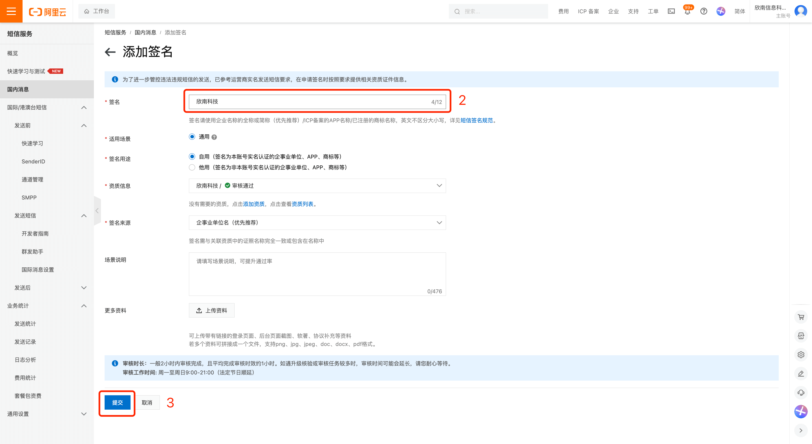
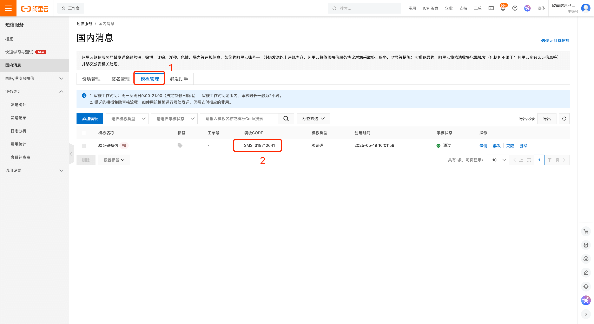
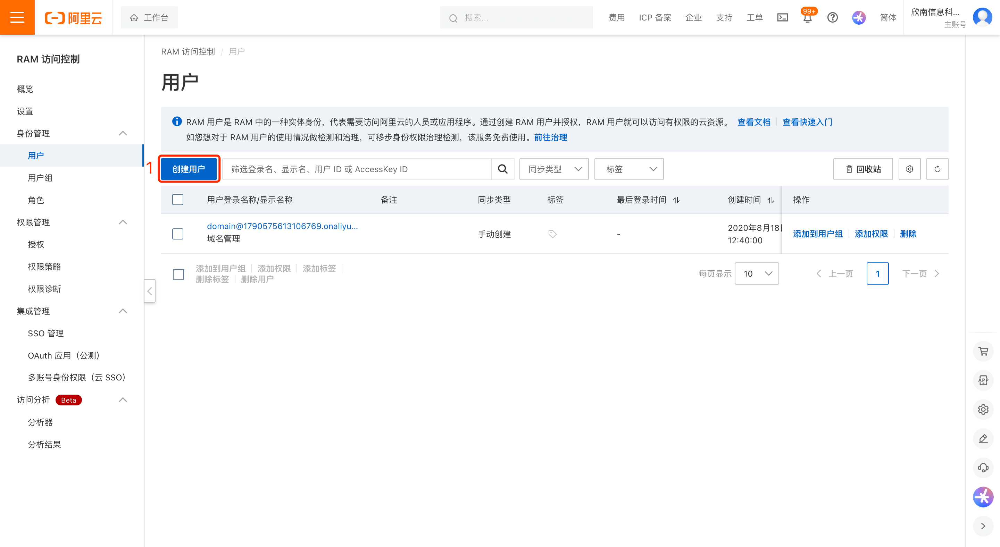
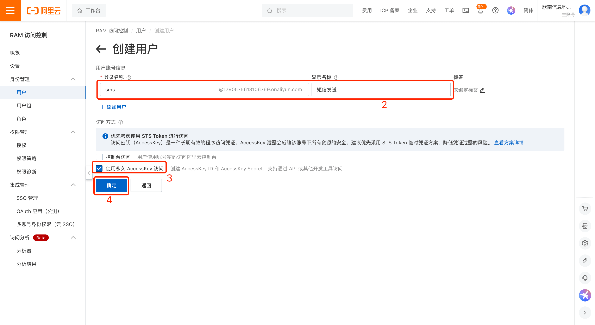
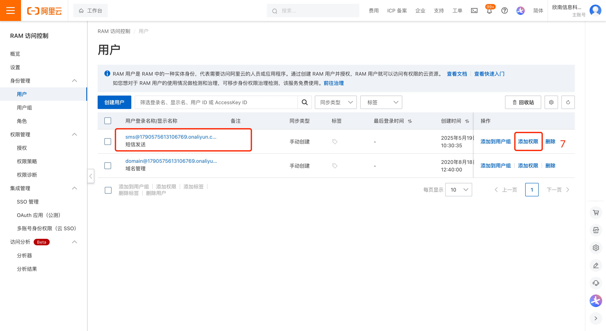
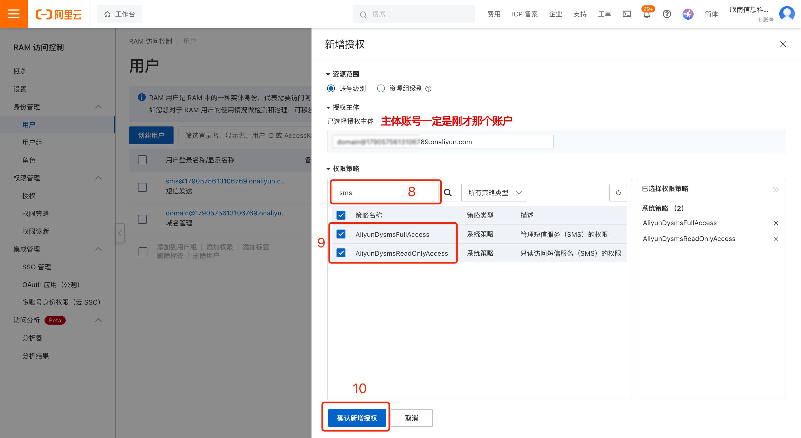
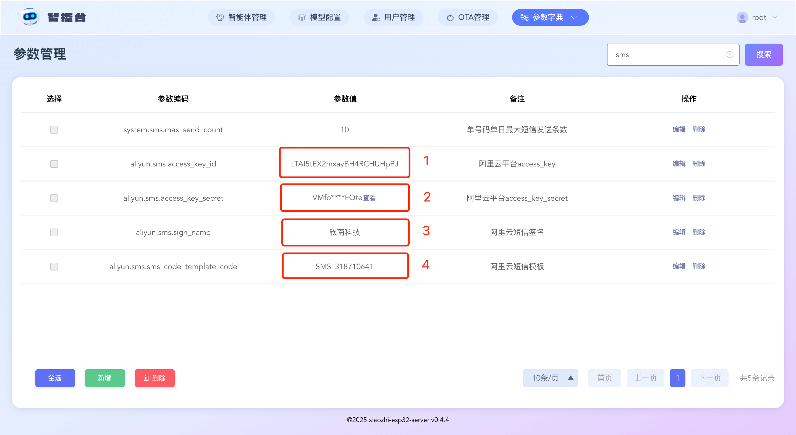

# Optional: Phone-Number Login via SMS (Alibaba Cloud)

> **⚠️ This feature is OPTIONAL — you do not need it.**
> SMS is only used for **phone-number login** (enter a mobile number, receive a 6-digit code by SMS, then sign in).
> It is **not required** for a normal install. The console's default login is the **admin username + password**
> you create on first registration. Leave `aliyun.sms.*` parameters empty and phone-number login stays disabled —
> everything else works normally. Skip this guide unless you specifically want phone-number login.

Log in to the Alibaba Cloud console and open the "SMS Service" page: https://dysms.console.aliyun.com/overview

## Step 1: Add a Signature
![Step — UI text shown: "SMS Services", "Overview", "Quick Learning & Testing", "Domestic Messages", "Important", "【Important】Due to differences in operator execution strategies, it may occur that the reporting result is "Reporting Successful" but some SMS messages fail to be sent. Please check the signature source and signature name according to the Signature Compliance Announcement. If the signature does not meet the standards, please replace or apply for a new signature. It is recommended to use the full name or abbreviation of "Enterprise/Institution Name" first. If the signature verification is correct, it is suggested to try sending SMS messages to mobile phone numbers of the three major operators in small quantities multiple times, and start batch sending only when the sending success rate meets the expected requirements.".](images/alisms/sms-01.png)

The steps above will give you a signature. Please write it into the Console parameter, `aliyun.sms.sign_name`

## Step 2: Add a Template

The steps above will give you a template code. Please write it into the Console parameter, `aliyun.sms.sms_code_template_code`

Note that the signature takes up to 7 business days, and you can only send messages successfully after the carrier has finished its filing review.

Note that the signature takes up to 7 business days, and you can only send messages successfully after the carrier has finished its filing review.

Note that the signature takes up to 7 business days, and you can only send messages successfully after the carrier has finished its filing review.

You can wait for the filing review to complete before continuing with the steps below.

## Step 3: Create an SMS Account and Enable Permissions

Log in to the Alibaba Cloud console and open the "Access Control" page: https://ram.console.aliyun.com/overview?activeTab=overview

The steps above will give you the access_key_id and access_key_secret. Please write them into the Console parameters, `aliyun.sms.access_key_id`, `aliyun.sms.access_key_secret`
## Step 4: Enable Mobile Registration

1. Normally, after you fill in all the information above, you will see this result. If you don't, a step may be missing.

2. Enable non-admin user registration by setting the parameter `server.allow_user_register` to `true`

3. Enable the mobile registration feature by setting the parameter `server.enable_mobile_register` to `true`
