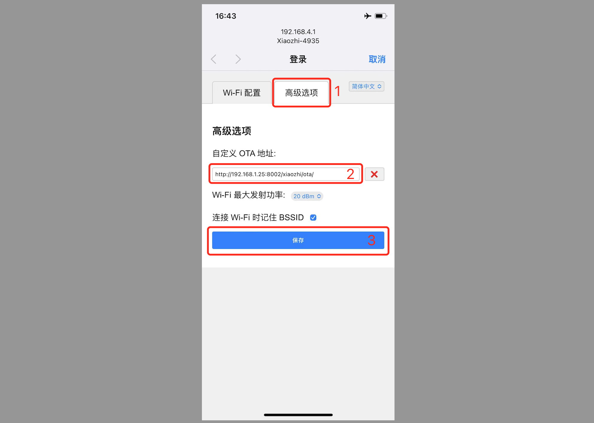

# Configure a Custom Server Based on the Firmware Compiled by Xiaoge

## Step 1: Confirm the Version
Flash the [firmware version 1.6.1 and above](https://github.com/78/xiaozhi-esp32/releases) that Xiaoge has already compiled.

## Step 2: Prepare Your OTA Address
If you used full-module deployment following the tutorial, you should have an OTA address.

At this point, open your OTA address in a browser. For example, my OTA address is
```
https://2662r3426b.vicp.fun/xiaozhi/ota/
```

If it shows "OTA interface running normally, number of websocket clusters: X", continue.

If it shows "OTA interface is not running normally", it is probably because you have not configured the `Websocket` address in the `console`. In that case:

- 1、Log in to the console as the super administrator

- 2、Click `Parameter Management` in the top menu

- 3、Find the `server.websocket` item in the list, and enter your `Websocket` address. For example, mine is

```
wss://2662r3426b.vicp.fun/xiaozhi/v1/
```

After configuring it, refresh your OTA interface address in the browser and see whether it is normal now. If it is still not normal, confirm again whether Websocket has started normally and whether the Websocket address has been configured.

## Step 3: Enter the Network Configuration Mode
Enter the device's network configuration (pairing) mode. At the top of the page, click "Advanced Options", enter your server's `ota` address, and click Save. Restart the device.


## Step 4: Wake Xiaozhi and Check the Log Output

Wake Xiaozhi and see whether the logs are output normally.

## Frequently Asked Questions
Here are some common questions for reference:

[1、Why does Xiaozhi recognize a lot of my speech as Korean, Japanese, or English?](./FAQ_en.md)

[2、Why does "TTS task error: file does not exist" appear?](./FAQ_en.md)

[3、TTS often fails and frequently times out](./FAQ_en.md)

[4、WiFi can connect to my self-built server, but 4G mode cannot](./FAQ_en.md)

[5、How do I improve Xiaozhi's conversation response speed?](./FAQ_en.md)

[6、I speak very slowly, and Xiaozhi always interrupts me during pauses](./FAQ_en.md)

[7、I want to control lights, air conditioners, remote power on/off, etc. through Xiaozhi](./FAQ_en.md)
