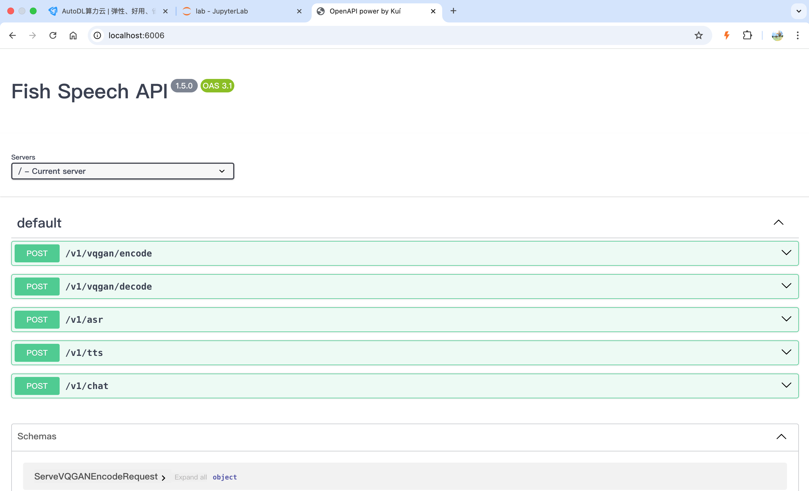

Log in to AutoDL and rent an image.
Choose the image:
```
PyTorch / 2.1.0 / 3.10(ubuntu22.04) / cuda 12.1
```

After the machine boots, set up academic acceleration
```
source /etc/network_turbo
```

Enter the working directory
```
cd autodl-tmp/
```

Clone the project
```
git clone https://gitclone.com/github.com/fishaudio/fish-speech.git ; cd fish-speech
```

Install dependencies
```
pip install -e.
```

If it reports an error, install portaudio
```
apt-get install portaudio19-dev -y
```

After installing, run
```
pip install torch==2.3.1 torchvision==0.18.1 torchaudio==2.3.1 --index-url https://download.pytorch.org/whl/cu121
```

Download the models
```
cd tools
python download_models.py 
```

After downloading the models, run the interface
```
python -m tools.api_server --listen 0.0.0.0:6006 
```

Then open the AutoDL instance page in your browser
```
https://autodl.com/console/instance/list
```

As shown below, click the `Custom Service` button of your machine to enable the port forwarding service.
![Custom Service — UI text shown: "Warning", "To comply with regulatory requirements, this region's HTTP/HTTPS services are only open to users who have completed enterprise authentication. You can access the service locally or watch the video tutorial.", "Windows Linux/Mac", "Windows users, open PowerShell; Mac/Linux users, open the terminal, and execute the following command and press Enter:", "ssh -CNg -L 6006:127.0.0.1:6006 root@connect.westb.seetacloud.com -p 31901", "If prompted with yes/no, answer yes and enter the following password (the password will not be displayed when pasted, which is normal).".](images/fishspeech/autodl-01.png)

Once the port forwarding service is set up, open `http://localhost:6006/` on your local computer to access the fish-speech interface.


If you are using single-module deployment, the core configuration is as follows:
```
selected_module:
  TTS: FishSpeech
TTS:
  FishSpeech:
    reference_audio: ["config/assets/wakeup_words.wav",]
    reference_text: ["哈啰啊，我是小智啦，声音好听的台湾女孩一枚，超开心认识你耶，最近在忙啥，别忘了给我来点有趣的料哦，我超爱听八卦的啦",]
    api_key: "123"
    api_url: "http://127.0.0.1:6006/v1/tts"
```

Then restart the service.