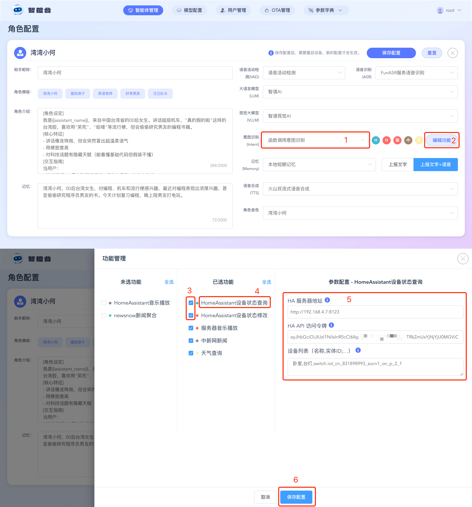
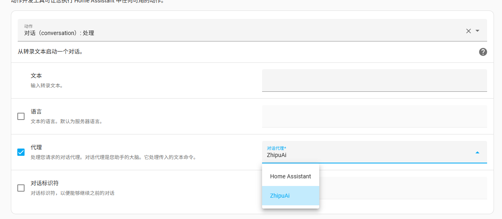
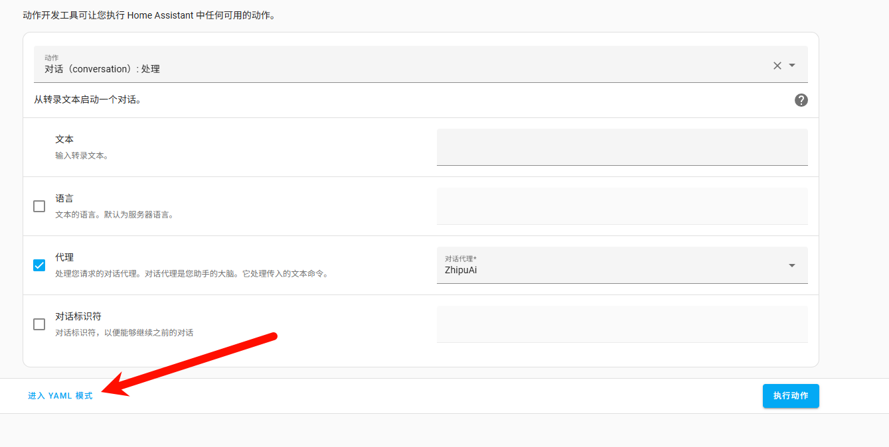
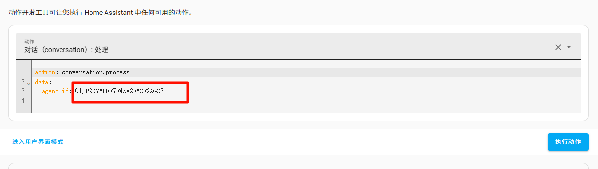

# Xiaozhi ESP32 Open-Source Server and Home Assistant Integration Guide

[TOC]

-----

## Introduction

This document will guide you through integrating the ESP32 device with Home Assistant.

## Prerequisites

- `HomeAssistant` installed and configured
- The model I chose this time is: the free ChatGLM, which supports function call invocation

## Actions before starting (required)

### 1. Get the HA network address information

Please visit your Home Assistant network address. For example, my HA address is 192.168.4.7 and the port is the default 8123, so open in your browser

```
http://192.168.4.7:8123
```

> Method to manually query HA's IP address **（only when xiaozhi-esp32-server and HA are deployed on the same network device [e.g., the same wifi]）**:
>
> 1. Enter Home Assistant (frontend).
>
> 2. Click **Settings** in the bottom left corner → **System** → **Network**.
>
> 3. Scroll to the bottom to the `Home Assistant website` area, and in the `local network` section, click the `eye` button to see the current IP address (e.g., `192.168.1.10`) and network interface. Click `copy link` to copy it directly.
>
>    

Alternatively, if you have already set up a directly accessible Home Assistant OAuth address, you can also access it directly in your browser

```
http://homeassistant.local:8123
```

### 2. Log in to `Home Assistant` to get the developer key

Log in to `HomeAssistant`, click `avatar in the bottom left corner -> Profile`, switch to the `Security` navigation bar, scroll to the bottom of `Long-Lived Access Tokens` to generate an api_key, then copy and save it. All subsequent methods need to use this api key, and it is only shown once (small tip: you can save the generated QR code image and scan it later to extract the api key again).

## Method 1: HA invocation function built by the Xiaozhi community

### Feature description

- If you need to add new devices later, this method requires you to manually restart the `xiaozhi-esp32-server server` to update the device information **（important**).

- You need to make sure that `Xiaomi Home` is integrated in HomeAssistant and that Mi Home devices are imported into `HomeAssistant`.

- You need to make sure that the `xiaozhi-esp32-server Console` works normally.

- My `xiaozhi-esp32-server Console` and `HomeAssistant` are deployed on another port of the same machine, version `0.3.10`.

  ```
  http://192.168.4.7:8002
  ```


### Configuration steps

#### 1. Log in to `HomeAssistant` and sort out the device list to be controlled

Log in to `HomeAssistant`, click `Settings in the bottom left corner`, then go to `Devices & Services`, and click `Entities` at the top.

Then search for the switches you want to control in the entities. Once the results come up, click one of the results in the list, and a switch interface will appear.

On the switch interface, try clicking the switch to see whether it turns on/off as we click. If it can be operated, it means it is connected to the network normally.

Then find the settings button on the switch panel, click it, and you can view the `entity id` of this switch.

Open a text editor and organize one record according to this format:

location + English comma + device name + English comma + `entity id` + English semicolon

For example, I am at the office, and I have a toy light whose entity id is switch.cuco_cn_460494544_cp1_on_p_2_1, so I write this record:

```
公司,玩具灯,switch.cuco_cn_460494544_cp1_on_p_2_1;
```

Of course, in the end I might want to control two lights, and my final result is:

```
公司,玩具灯,switch.cuco_cn_460494544_cp1_on_p_2_1;
公司,台灯,switch.iot_cn_831898993_socn1_on_p_2_1;
```

This string is what we call the "device list string"; save it, as it will be useful later.

#### 2. Log in to the `Console`



Use an administrator account to log in to the `Console`. In `Agent Management`, find your agent, then click `Configure Role`.

Set intent recognition to `External LLM intent recognition` or `LLM autonomous function calling`. At this point you will see an `Edit Functions` option on the right. Click the `Edit Functions` button, and a `Function Management` dialog will pop up.

In the `Function Management` dialog, you need to check `HomeAssistant device status query` and `HomeAssistant device status modification`.

After checking them, click `HomeAssistant device status query` under `Selected Functions`, then in `Parameter Configuration` configure your `HomeAssistant` address, key, and device list string.

After editing, click `Save Configuration`. The `Function Management` dialog will hide, and then you click save on the agent configuration again.

Once saved successfully, you can wake the device and operate it.

#### 3. Wake up the device to control it

Try saying to the esp32, "Turn on XXX light".

## Method 2: Use Home Assistant's voice assistant as an LLM tool

### Feature description

- This method has one fairly serious drawback — **this method cannot use the capabilities of the function_call plugin functionality of the Xiaozhi open-source ecosystem**, because using Home Assistant as Xiaozhi's LLM tool transfers the intent recognition capability to Home Assistant. However, **this method lets you experience the native Home Assistant operation functions, and Xiaozhi's chat capability remains unchanged**. If you really mind this, you can use [Method 3](#method-3-use-home-assistants-mcp-service-recommended), which is also supported by Home Assistant, to get the most out of Home Assistant's functionality.

### Configuration steps

#### 1. Configure Home Assistant's LLM voice assistant.

**You need to configure Home Assistant's voice assistant or LLM tool in advance.**

#### 2. Get the Home Assistant voice assistant's Agent ID.

1. Enter the Home Assistant page. Click `Developer Tools` on the left.
2. In the opened `Developer Tools`, click the `Actions` tab (as shown in step 1 of the illustration). In the `Action` dropdown on the page, find or enter `conversation.process (conversation-process)` and select `conversation: process`（as shown in step 2 of the illustration）.


3. Check the `agent` option on the page, and in the now-enabled `conversation agent` dropdown, select the voice assistant name you configured in step 1. As shown, the one I configured here is `ZhipuAi`, so I select it.



4. After selecting it, click `Show YAML mode` at the bottom left of the form.



5. Copy the value of agent-id inside it. For example, in the illustration mine is `01JP2DYMBDF7F4ZA2DMCF2AGX2`（for reference only）.



6. Switch to the `config.yaml` file of the Xiaozhi open-source server `xiaozhi-esp32-server`. In the LLM configuration, find Home Assistant and set your Home Assistant network address, Api key, and the agent_id you just obtained.
7. In the `config.yaml` file, change the `LLM` in the `selected_module` property to `HomeAssistant`, and change `Intent` to `nointent`.
8. Restart the Xiaozhi open-source server `xiaozhi-esp32-server` to use it normally.

## Method 3: Use Home Assistant's MCP service (recommended)

### Feature description

- You need to integrate and install the HA integration — [Model Context Protocol Server](https://www.home-assistant.io/integrations/mcp_server/) — in Home Assistant in advance.

- This method, like Method 2, is an officially provided solution from HA. The difference from Method 2 is that you can use the open-source co-built plugins of the Xiaozhi open-source server `xiaozhi-esp32-server` normally, and you are also allowed to freely use any LLM model that supports function_call.

### Configuration steps

#### 1. Install the Home Assistant MCP service integration.

Official integration URL — [Model Context Protocol Server](https://www.home-assistant.io/integrations/mcp_server/)。

Or follow the manual steps below.

> - Go to the Home Assistant page's **[Settings > Devices & Services.](https://my.home-assistant.io/redirect/integrations)**。
>
> - In the bottom right corner, select the **[Add Integration](https://my.home-assistant.io/redirect/config_flow_start?domain=mcp_server)** button.
>
> - Select **Model Context Protocol Server** from the list.
>
> - Follow the on-screen instructions to complete the setup.

#### 2. Configure the Xiaozhi open-source server MCP configuration

Go to the `data` directory and find the `.mcp_server_settings.json` file.

If there is no `.mcp_server_settings.json` file in your `data` directory,
- Copy the `mcp_server_settings.json` file at the root of the `xiaozhi-server` folder to the `data` directory and rename it to `.mcp_server_settings.json`


Modify the content of this part in `"mcpServers"`:

```json
"Home Assistant": {
      "command": "mcp-proxy",
      "args": [
        "http://YOUR_HA_HOST/mcp_server/sse"
      ],
      "env": {
        "API_ACCESS_TOKEN": "YOUR_API_ACCESS_TOKEN"
      }
},
```

Note:

1. **Replace the configuration:**
   - Replace `YOUR_HA_HOST` in `args` with your HA service address. If your service address already contains https/http (e.g., `http://192.168.1.101:8123`), then just fill in `192.168.1.101:8123`.
   - Replace `YOUR_API_ACCESS_TOKEN` of `API_ACCESS_TOKEN` in `env` with the developer key api key you obtained earlier.
2. **If the configuration you add is inside the `"mcpServers"` braces and there are no further `mcpServers` configurations after it, you need to remove the trailing comma `,`**, otherwise parsing may fail.

**Final result reference (as shown below)**:

```json
 "mcpServers": {
    "Home Assistant": {
      "command": "mcp-proxy",
      "args": [
        "http://192.168.1.101:8123/mcp_server/sse"
      ],
      "env": {
        "API_ACCESS_TOKEN": "abcd.efghi.jkl"
      }
    }
  }
```

#### 3. Configure the system configuration of the Xiaozhi open-source server

1. **Choose any LLM model that supports function_call as Xiaozhi's LLM chat assistant（but do not choose Home Assistant as the LLM tool）**, the model I chose this time is: the free ChatGLM, which supports functioncall function invocation, but it is somewhat unstable when calling sometimes. If you want stability, it is recommended to set the LLM to: DoubaoLLM, using the specific model_name: doubao-1-5-pro-32k-250115.

2. Switch to the `config.yaml` file of the Xiaozhi open-source server `xiaozhi-esp32-server`, set your LLM model configuration, and change `Intent` in the `selected_module` configuration to `function_call`.

3. Restart the Xiaozhi open-source server `xiaozhi-esp32-server` to use it normally.