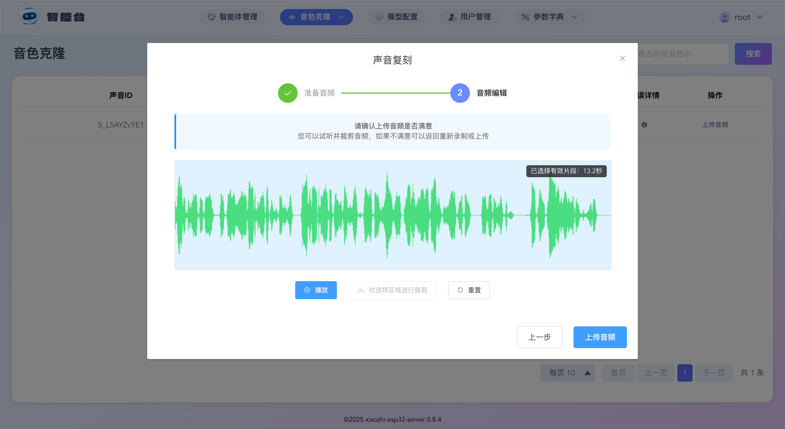

# Console: Volcano Engine streaming TTS + voice clone configuration tutorial

This tutorial is divided into 4 stages: preparation, configuration, cloning, and usage. It mainly introduces the process of configuring Volcano Engine streaming TTS + voice cloning through the Console.

## Stage 1: Preparation
The super administrator should first enable the Volcano Engine service in advance and obtain the App Id and Access Token. By default, the Volcano Engine grants one timbre/voice resource. This voice resource needs to be copied into this project.

If you want to clone multiple voices, you need to purchase and enable multiple voice resources. Just copy each voice resource's voice ID (S_xxxxx) into this project, and then assign them to the system accounts for use. Here are the detailed steps:

### 1. Enable the Volcano Engine service
Visit https://console.volcengine.com/speech/app to create an application in App Management, and select the large speech synthesis model and the voice replication model.

### 2. Obtain the voice resource ID
Visit https://console.volcengine.com/speech/service/9999 and copy three items: the App Id, the Access Token, and the voice ID (S_xxxxx). As shown:

## Stage 2: Configure the Volcano Engine service

### 1. Fill in the Volcano Engine configuration

Use the super administrator account to log in to the Console, click [Model Configuration] at the top, then click [Speech Synthesis] on the left side of the model configuration page, search for "Volcano Engine streaming TTS", click Modify, fill your Volcano Engine `App Id` into the [App ID] field, and fill the `Access Token` into the [Access Token] field. Then save.

### 2. Assign the voice resource ID to system accounts

Use the super administrator account to log in to the Console, click `Parameter Dictionary` at the top, and in the dropdown menu click the `System Function Configuration` page. On the page, check `Voice Clone` and click Save Configuration. You will then see the `Voice Clone` button in the top menu.

Use the super administrator account to log in to the Console, and click [Voice Clone] and [Voice Resources] at the top.

Click the Add button, and select "Volcano Engine streaming TTS" in [Platform Name];

Fill in your Volcano Engine voice resource ID (S_xxxxx) in [Voice Resource ID], and press Enter after filling it in;

In [Owning Account], select the system account you want to assign it to. You can assign it to yourself. Then click Save.

## Stage 3: Cloning stage

If after logging in you click [Voice Clone] 》 [Voice Clone] at the top and it shows [Your account has no voice resources, please contact the administrator to assign voice resources], it means that in Stage 2 you have not yet assigned the voice resource ID to this account. Go back to Stage 2 and assign a voice resource to the corresponding account.

If after logging in you click [Voice Clone] 》 [Voice Clone] at the top and can see the corresponding voice list, please continue.

You will see the corresponding voice list in the list. Select one of the voice resources and click the [Upload Audio] button. After uploading, you can preview the voice or clip a section of it. After confirming, click the [Upload Audio] button.

After uploading the audio, you will see in the list that the corresponding voice changes to the "Pending Clone" status. Click the [Clone Now] button. Wait 1~2 seconds for the result to return.

If the cloning fails, hover the mouse over the "error message" icon, and the reason for the failure will be shown.

If the cloning succeeds, you will see in the list that the corresponding voice changes to the "Training Succeeded" status. At this point you can click the modify button in the [Voice Name] column to change the name of the voice resource, making it easier to select and use later.

## Stage 4: Usage stage

Click [Agent Management] at the top, select any agent, and click the [Configure Role] button.

Select "Volcano Engine streaming TTS" for Speech Synthesis (TTS). In the list, find the voice resource whose name contains "Cloned Voice" (as shown), select it, and click Save.

Next, you can wake up Xiaozhi and have a conversation with it.
