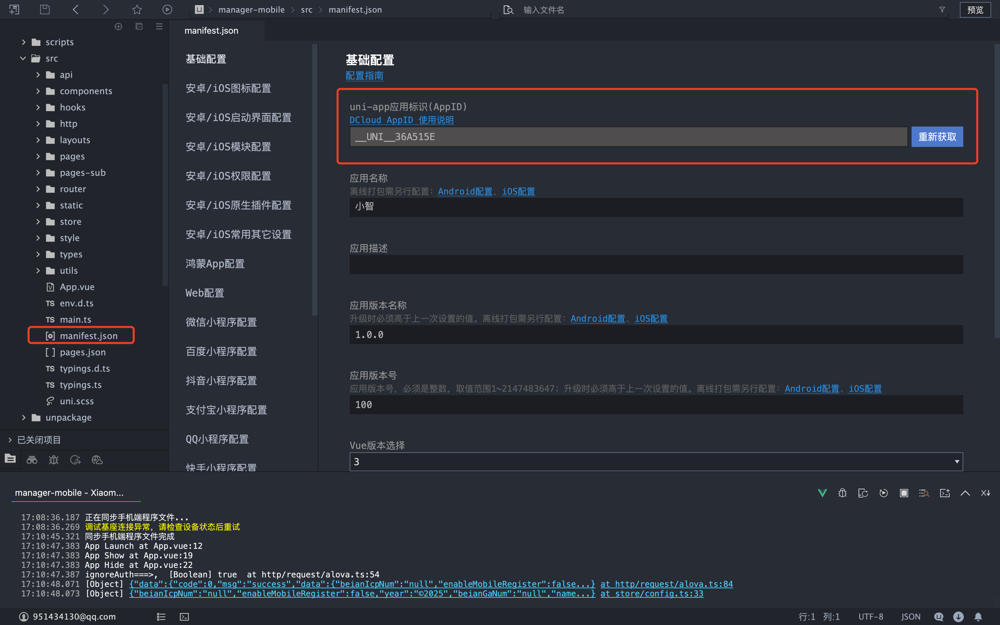
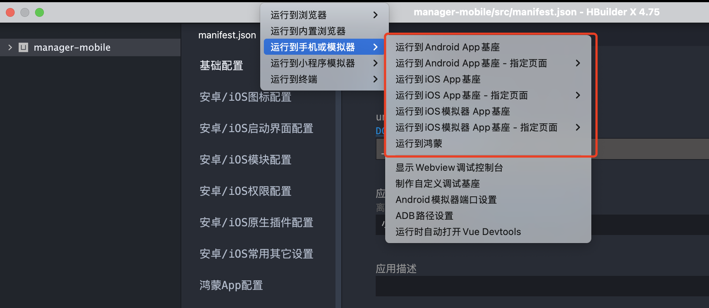
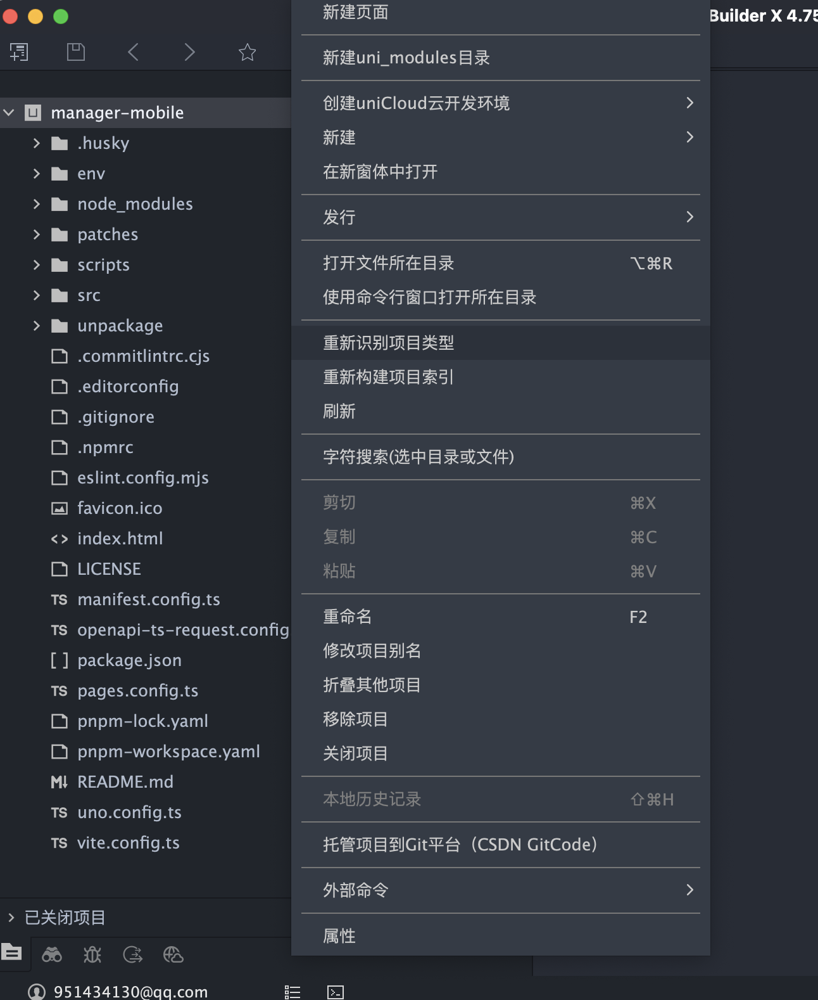
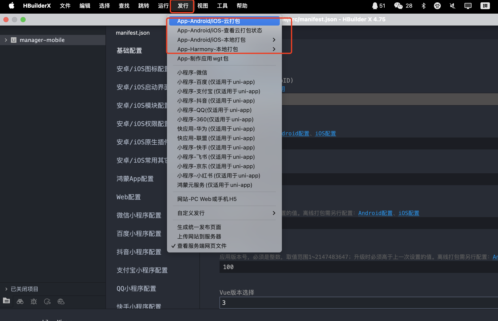
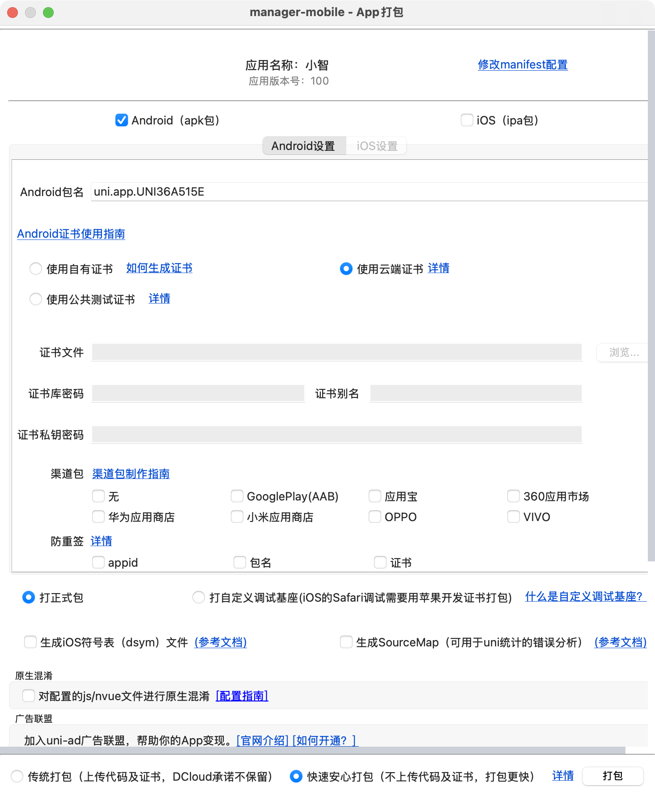

## Console Mobile (manager-mobile)

A cross-platform mobile admin client built with uni-app v3 + Vue 3 + Vite, supporting App (Android & iOS) and WeChat Mini Program.

### Platform Compatibility

| H5 | iOS | Android | WeChat Mini Program |
| -- | --- | ------- | ------------------ |
| √  | √   | √       | √                  |

Note: Different UI components may have slightly different levels of adaptation across platforms. Please refer to the corresponding component library documentation.

### Development Environment Requirements
- Node >= 18
- pnpm >= 7.30 (recommended to use the `pnpm@10.x` declared in the project)
- Optional: HBuilderX (App debugging/packaging), WeChat DevTools (WeChat Mini Program)

### Quick Start
1) Configure environment variables
   - Copy `env/.env.example` to `env/.env.development`
   - Modify the configuration items according to your situation (especially `VITE_SERVER_BASEURL`, `VITE_UNI_APPID`, `VITE_WX_APPID`)

2) Install dependencies

```bash
pnpm i
```

3) Local development (hot reload)
- h5: `pnpm dev:h5`, then check the IP and port shown in the startup logs
- WeChat Mini Program: `pnpm dev:mp` or `pnpm dev:mp-weixin`, then import `dist/dev/mp-weixin` into WeChat DevTools
- App: import `manager-mobile` into HBuilderX, then follow the tutorials below to run it

### Environment Variables and Configuration
The project uses a custom `env` directory to store environment files, named per the Vite convention: `.env.development`, `.env.production`, etc.

Key variables (partial):
- VITE_APP_TITLE: application name (written into `manifest.config.ts`)
- VITE_UNI_APPID: uni-app application appid (App)
- VITE_WX_APPID: WeChat Mini Program appid (mp-weixin)
- VITE_FALLBACK_LOCALE: default language, e.g. `zh-Hans`
- VITE_SERVER_BASEURL: server base URL (HTTP request baseURL)
- VITE_DELETE_CONSOLE: whether to remove console calls at build time (`true`/`false`)
- VITE_SHOW_SOURCEMAP: whether to generate sourcemaps (disabled by default)
- VITE_LOGIN_URL: the login page path to redirect to when not logged in (used by the route interceptor)

Example (`env/.env.development`):
```env
VITE_APP_TITLE=Xiaozhi
VITE_FALLBACK_LOCALE=zh-Hans
VITE_UNI_APPID=
VITE_WX_APPID=

VITE_SERVER_BASEURL=http://localhost:8080

VITE_DELETE_CONSOLE=false
VITE_SHOW_SOURCEMAP=false
VITE_LOGIN_URL=/pages/login/index
```

Notes:
- `manifest.config.ts` reads the title, appid, locale, and other settings from `env`.

### Important Notes
⚠️ **Configuration items that must be changed before deployment:**

1. **App ID configuration**
   - `VITE_UNI_APPID`: create an app in the [DCloud Developer Center](https://dev.dcloud.net.cn/) and get the AppID
   - `VITE_WX_APPID`: register a mini program on the [WeChat Official Platform](https://mp.weixin.qq.com/) and get the AppID

2. **Server address**
   - `VITE_SERVER_BASEURL`: change to your actual server address

3. **App information**
   - `VITE_APP_TITLE`: change to your application name
   - Update icon resources such as `src/static/logo.png`

4. **Other configuration**
   - Review the application configuration in `manifest.config.ts`
   - Modify the tabBar configuration in `src/layouts/fg-tabbar/tabbarList.ts` as needed

### Detailed Operation Guide

#### 1. Get a uni-app AppID

- Copy the generated AppID into the `VITE_UNI_APPID` environment variable

#### 2. Local Run Steps


**App local debugging:**
1. Import the `manager-mobile` directory into HBuilderX
2. Re-identify the project
3. Connect a phone or use an emulator for on-device debugging

**Resolving project identification issues:**


If HBuilderX fails to correctly identify the project type:
- Right-click the project root and select "Re-identify Project Type"
- Make sure the project is identified as a "uni-app" project

### Routing and Authentication
- The route interceptor plugin `routeInterceptor` is registered in `src/main.ts`.
- Blacklist interception: only pages configured to require login are validated (from `getNeedLoginPages` in `@/utils`).
- Login check: based on user information (the `useUserStore` in `pinia`); when not logged in, it redirects to `VITE_LOGIN_URL` with a parameter to redirect back to the original page.

### Network Requests
- Based on `alova` + `@alova/adapter-uniapp`, the instance is created centrally in `src/http/request/alova.ts`.
- `baseURL` reads the environment configuration (`getEnvBaseUrl`); the domain can be switched dynamically via `method.config.meta.domain`.
- Authentication: the `Authorization` header is injected by default from the local `token` (`uni.getStorageSync('token')`); if missing, it redirects to login.
- Response: HTTP errors where `statusCode !== 200` and business errors where `code !== 0` are handled uniformly; on `401` the token is cleared and it redirects to login.

### Build and Release

**WeChat Mini Program:**
1. Make sure the correct `VITE_WX_APPID` is configured
2. Run `pnpm build:mp`; output is in `dist/build/mp-weixin`
3. Import the project directory into WeChat DevTools and upload the code
4. Submit for review on the WeChat Official Platform

**Android & iOS App:**

#### 3. App Packaging and Release Steps

**Step one: prepare for packaging**


1. Make sure the correct `VITE_UNI_APPID` is configured
2. Run `pnpm build:app`; output is in `dist/build/app`
3. Import the project directory into HBuilderX
4. In HBuilderX, click "Release" → "Native App-Cloud Packaging"

**Step two: configure packaging parameters**


1. **App icon and splash screen**: upload the app icon and splash screen image
2. **App version**: set the version number and version name
3. **Signing certificate**:
   - Android: upload the keystore certificate file
   - iOS: configure the developer certificate and provisioning profile
4. **Package name configuration**: set the app package name (Bundle ID)
5. **Packaging type**: choose a test package or a release package
6. Click "Package" to start the cloud packaging process

**Publishing to app stores:**
- **Android**: upload the generated APK file to the various Android app stores
- **iOS**: upload the generated IPA file to the App Store via App Store Connect (requires an Apple developer account)

### Conventions and Engineering Setup
- Pages and subpackages: generated uniformly by `@uni-helper/vite-plugin-uni-pages` and `pages.config.ts`; the tabBar configuration is in `src/layouts/fg-tabbar/tabbarList.ts`.
- Auto-import of components and hooks: see `unplugin-auto-import` and `@uni-helper/vite-plugin-uni-components` in `vite.config.ts`.
- Styling: uses UnoCSS and `src/style/index.scss`.
- State management: `pinia` + `pinia-plugin-persistedstate`.
- Code standards: built-in `eslint`, `husky`, `lint-staged`; auto-formatting before commit (`lint-staged`).

### Common Scripts
```bash
# Development
pnpm dev:mp        # equivalent to dev:mp-weixin

# Build
pnpm build:mp      # equivalent to build:mp-weixin

# Other
pnpm type-check
pnpm lint && pnpm lint:fix
```

### License
MIT
